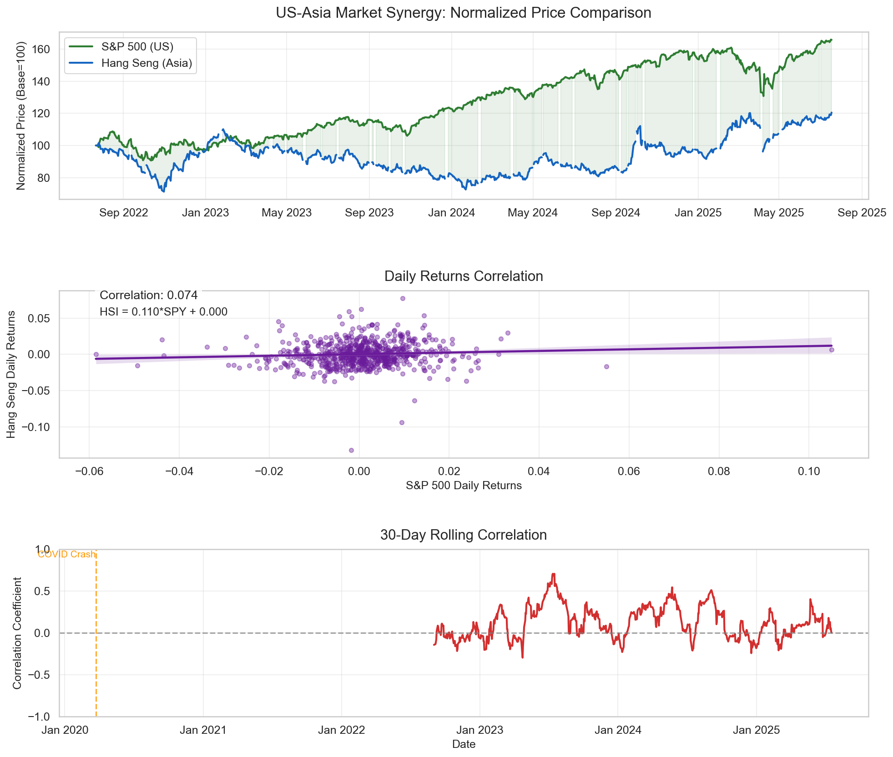

# US-Asia Market Analysis Project

## Project Overview
This project explores the relationship between US and Asian financial markets through data analysis and visualization. It focuses on understanding how these markets interact and influence each other, using historical price data.
## What's Inside
- **Data Collection**: Scripts to download historical market data from Yahoo Finance.
- **Market Analysis**: Visualizations and statistical analysis of US and Asian markets.
- **Correlation Studies**: Examining how market movements in one region relate to another.

## Insights for US and Asian Market Synergy
- The US and Asian markets (as represented by the S&P 500 and Hang Seng) have not moved in tandem. The US market has performed much better. The lack of consistent correlation means that diversifying between these two markets could help reduce risk because when one market is down, the other might not be.
  
1. Both markets have shown growth over the period, but the US market (S&P 500) has significantly outperformed the Asian market (Hang Seng):
  - The S&P 500 reached around 160 (a 60% increase from the starting point) by September 2025, while the Hang Seng only reached about 120 (a 20% increase) in the      same period.
2. The US and Asian markets moved independently on a day-to-day basis during this period:
  - The S&P 500 reached around 160 (a 60% increase from the starting point) by September 2025, while the Hang Seng only reached about 120 (a 20% increase) in the      same period.
  - The correlation coefficient is 0.074, which is very low (close to zero). This means there is almost no linear relationship between the daily returns of the        two markets.
3. the relationship between the two markets is not consistent:
  - The correlation has fluctuated between about -0.5 and 0.5, meaning sometimes the markets moved in the same direction (positive correlation) and sometimes in       opposite directions (negative correlation).

## Insights for US market
 - The US stock market (SPY and QQQ) has been in an upward trend with moderate volatility. Bonds (TLT) and volatility (VXX) have behaved as expected in relation to stocks, providing diversification benefits. The negative correlation between stocks and bonds (or stocks and volatility) means that holding both can help reduce portfolio risk.
   
Price Trends
  - SPY and QQQ (representing stocks) have an upward trend, with QQQ growing more than SPY (as expected because QQQ is tech-heavy).
  - VXX (volatility) has been declining, meaning the market has become less volatile over time.
  - TLT (bonds) has been relatively flat or declining, which might be due to rising interest rates.
Volatility
  - VXX (volatility index) has the highest volatility, which is expected because it's designed to measure market volatility.
  - SPY and QQQ have similar volatility patterns, but QQQ is slightly more volatile than SPY (common because tech stocks are more volatile).
  - TLT (bonds) has lower volatility than stocks but higher than what is typical for bonds because of the interest rate changes in this period.
Correlation
  - SPY and QQQ are highly positively correlated (0.99). This means they tend to move together.
  - Both SPY and QQQ are negatively correlated with VXX (around -0.75 to -0.79). This is because when the stock market goes up, volatility usually goes down, and      vice versa.
  - TLT (bonds) has a negative correlation with stocks (SPY and QQQ) but positive with VXX (volatility). This is typical because bonds are considered safer and tend to go up when stocks go down (and volatility goes up).

## Project Goals
- To learn about financial data analysis and visualization.
- To understand the dynamics between US and Asian markets.
- To practice Python programming in a finance context.

## Structure
```
├── data_sourcing/       # Scripts to collect market data
├── market_analysis/     # Analysis and visualization scripts
├── visualizations/      # Generated charts (not version controlled)
├── .gitignore
├── README.md
└── requirements.txt

## Contributions
This is a learning project. Feedback and suggestions are welcome!
## Disclaimer
This project is for educational purposes only. It does not provide financial advice or trading recommendations.
